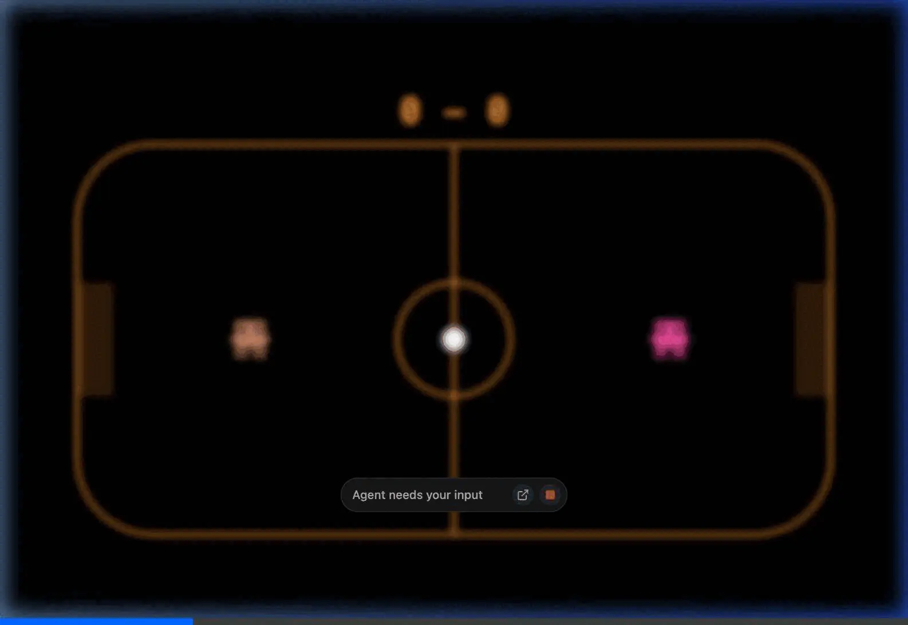

# Claude Party Game 🏑

A simple, fast-paced 1-on-1 2D hockey party game built directly for the browser! Experience highly optimized collision physics, responsive controls, and a retro minimalist Claude-inspired design.



## 🎮 Controls
* **Orange Player:** `W`, `A`, `S`, `D` 
* **Pink Player:** `O`, `K`, `L`, `;`

*(The players must bump the puck to score goals on the opposing sides of the ice rink!)*

## 🚀 Running the Game
Serve this directory locally:
```bash
python3 -m http.server 8080
```
Then navigate to `http://localhost:8080`.

## 🛠 Features
- **Perfectly Elastic Collisions:** Smooth math-driven puck bouncing mechanics.
- **Adjustable Physics:** Tweak player/puck weights and speeds directly in the constants!
- **Zero Dependencies:** Pure HTML Canvas and JS with no external libraries.
